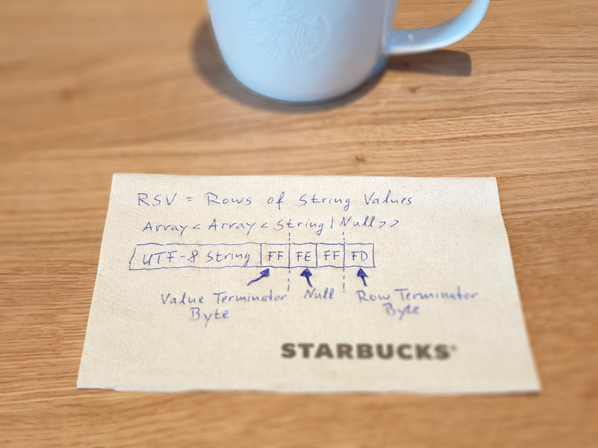

# Rows of String Values (RSV Data Format) Specification

The RSV data file format is a simple binary alternative to CSV.
This document describes the data structure behind RSV and defines the encoding used.
If you want to watch an explanation video about RSV, you can watch the following YouTube video:
[RSV - Rows of String Values - A Simple Binary Alternative to CSV](https://www.youtube.com/watch?v=tb_70o6ohMA)

## RSV Data Structure

An RSV document represents an array of arrays of nullable string values, also called a jagged array.

```
Array<Array<String|Null>>
```

It's main purpose is to store tabular data. But because it's a jagged array, it's not limited to that.
So, rows can contain the same number of values, but don't have to.

### Tabular Data

Here is an example of tabular data:

| FirstName | LastName | Age          | PlaceOfBirth  |
| --------- | -------- | ------------ | ------------- |
| William   | Smith    | 30           | Boston        |
| Olivia    | Jones    | 27           | San Francisco |
| Lucas     | Brown    | &lt;Null&gt; | Chicago       |

We have four columns, a header row, and three data rows.
There is one age value missing, so we have a null value.

Expressed as a JSON document, our example would look like this:

```json
[
  ["FirstName", "LastName", "Age", "PlaceOfBirth"],
  ["William",   "Smith",    "30",  "Boston"],
  ["Olivia",    "Jones",    "27",  "San Francisco"],
  ["Lucas",     "Brown",    null,  "Chicago"]
]
```

We can see the array of arrays, our string values, and the null value.

### Non-Tabular Data

Now let's have a look at an example of non-tabular data.

```
+------+
| 2D   |
+------+----+----+----+----+----+----+----+----+
| Pts  |  1 |  1 |  1 | -1 | -1 | -1 | -1 |  1 |
+------+----+----+----+----+----+----+----+----+
| Tris |  0 |  1 |  2 |  2 |  3 |  0 |
+------+----+----+----+----+----+----+
```

Here we have a small 2D vector graphics format, that describes a list of four points
and a list of two triangles indexing the previously defined points.
In this example we can clearly see, that the number of values per row can vary.

Again as JSON-document, the example would look like this:

```json
[
  ["2D"],
  ["Pts", "1", "1", "1", "-1", "-1", "-1", "-1", "1"],
  ["Tris", "0", "1", "2", "2", "3", "0"]
]
```
### Value Types

Notice in the previous example, that numbers are also represented as strings,
because RSV does not differentiate between different data types like boolean or numbers,
but instead has only string or null values.

```json
["Tris", "0", "1", "2", "2", "3", "0"]
```

The interpretation of these values is up to the program,
or depends on the custom data format, which was build upon RSV.

Not having special data types makes the format both simple and universal,
because you can represent every data type as string,
without worrying about precision (int32, int64, ...) or aspects like endianness (little/big).
It also makes writing code to read and write RSV documents really easy.

## RSV Encoding

Now that we have an idea about the type of data we can represent with RSV,
let's have a look at how an RSV document is actually encoded.

### Differences to CSV

A first difference to CSV is that RSV is a binary format
and not a textual format like CSV, which means an RSV file is not meant
to be opened with a text editor. Doing so will result in the display
of weird characters, and thus is not recommended.

This is a typical property of binary formats, which sacrifice
this sort of readability in order to offer other benefits
like better reading and writing performance,
or not having you to write a complex parser.
In case of RSV it has a nice advantage, which we will now have a look at.

In order for a textual data format
like CSV or TSV to indicate where
one value ends and another value begins,
a delimiter character must be defined.
In case of CSV this might be a comma,
or a semicolon, or in case of TSV
a simple tab character.

```
a,b,c
a;b;c
a→b→c 
```

Another delimiter is also needed, to indicate the end of one row,
and the beginning of the following row.
In case of CSV or TSV, this might be a single line break
character like a line feed (LF) or a combination using the carriage return character (CR).

```
a,b,c<LF>    vs.   a,b,c<CR><LF>
d,e                d,e
```

This works perfectly well, as long as the values themselves don't contain
these delimiters. But this is kind of fragile, because what happens when they do contain these delimiters?
This is refered to as [delimiter collision](https://en.wikipedia.org/wiki/Delimiter#Delimiter_collision).
And one solution for it is to use some sort of escape sequences, so that you can differentiate those cases.

For CSV a common approach is to put values containing commas or line breaks
inside of double quotes:

```
"a,a",b,c
```

But then again the double quote character itself becomes a delimiter, and you must handle the case
when a value contains it.

```
"a,""a",b,c
```

### Avoiding Delimiter Collision

This all comes with a processing cost, and raises the question,
if we could avoid delimiter collision at all?

And yes, with a binary format, we can. With a binary format we can simply write the length
of a string value before the actual data. But that approach might significantly
increase the size of the resulting file, if a fixed-width encoding is used
for the length values, or makes the format more complicated when you need to think about encoding
the length values with a variable-width encoding scheme (VarInts), to only use a minimal
number of bytes.

You also need to write a value that indicates how many values a row contains,
or how many bytes it will take. But this approach might limit the flexibility of appending
values to an existing file.

So that's why RSV does not follow this approach.

### RSV's Special Bytes

Instead of using length values prefixed, RSV uses special bytes
to indicate the end of a value (EOV), or the end of a row (EOR).

These terminating bytes are possible, because RSV strings are Unicode strings,
and are encoded using [UTF-8](https://en.wikipedia.org/wiki/UTF-8#Encoding).

| From    | To       | Byte 1   | Byte 2   | Byte 3   | Byte 4   |
| ---     | ---      | ---      | ---      | ---      | ---      |
| U+0000  | U+007F   | 0xxxxxxx | -        | -        | -        |
| U+0080  | U+07FF   | 110xxxxx | 10xxxxxx | -        | -        |
| U+0800  | U+FFFF   | 1110xxxx | 10xxxxxx | 10xxxxxx | -        |
| U+10000 | U+10FFFF | 11110xxx | 10xxxxxx | 10xxxxxx | 10xxxxxx |

With the UTF-8 encoding and it's specific
byte pattern, there is a range of bytes, that will never be produced by the encoding scheme.

| Binary       | Hex  | Decimal |
| ---          | ---  | ---     |
| 11111**111** | FF   | 255     |
| 11111**110** | FE   | 254     |
| 11111**101** | FD   | 253     |
| 11111**100** | FC   | 252     |
| 11111**011** | FB   | 251     |
| 11111**010** | FA   | 250     |
| 11111**001** | F9   | 249     |
| 11111**000** | F8   | 248     |

These bytes, which are invalid UTF-8 bytes,
invalid, because they should be rejected by a UTF-8 decoder,
can be used in a binary format to convey special meaning.

RSV uses three of these special bytes, which are the bytes 253, 254, and 255.

```
11111111  FF  255  =  Value Terminator Byte
11111110  FE  254  =  Null Value Byte
11111101  FD  253  =  Row Terminator Byte
```

Byte 255 is used to terminate a value, byte 254 signals a null value,
and byte 253 is used to terminate a row.
These three bytes will never collide with any byte-value of a UTF-8 encoded string value.
So we completely get rid of delimiter collision, and don't have to check our string values
for special characters and don't need to resort to any kind of escape sequences.

### Terminating vs. Separating

So we've learned that two bytes are terminating bytes.
This aspect of RSV is also a big difference to CSV or Comma-Separated Values,
where, like the name already tells us, values are separated by a delimiter,
instead of being terminated by. Having every row of an RSV file
being terminated by our special byte, has the nice advantage,
that RSV files can simply be concatenated. It also makes the special case
of an empty RSV file without any rows possible:


```json
[
]
```

## Simple RSV Example

Now that we know the basics of the RSV encoding, let's have a look
at a simple example:

```json
[
  ["Hello", "🌎"]
]
```

Here we have a single row, containing two strings. First the string 'hello' and then a second string,
simply containing a world emoji.

The encoding process would look like this. First, we write the UTF-8 bytes of
the hello string. All 5 characters are ASCII characters, so there is nothing special here:

```
72 101 108 108 111
```

We terminate the value with byte 255 and go on to the next string:

```
72 101 108 108 111|255
                   ^^^
```

The world emoji is a Unicode supplementary character that requires 4 bytes
when encoded using UTF-8:

```
72 101 108 108 111|255|240 159 140 142
                       ^^^ ^^^ ^^^ ^^^
```

Again we terminate the value with byte 255:

```
72 101 108 108 111|255|240 159 140 142|255
                                       ^^^
```

And because we've reached the end of the row, we terimate it using our special byte 253.
And this is our resulting byte sequence for our simple RSV document:

```
72 101 108 108 111|255|240 159 140 142|255|253
                                           ^^^
```

Now let's add two other rows to our document, the first being empty,
and the second containing a null value and an empty string value:

```json
[
  ["Hello", "🌎"],
  [],
  [null, ""]
]
```

The empty row would simply add another byte 253 to our byte sequence:

```
72 101 108 108 111|255|240 159 140 142|255|253|253
                                               ^^^
```

And the last row would encode like this. For the null value we add special byte 254,
and terminate it with byte 255:

```
72 101 108 108 111|255|240 159 140 142|255|253|253|254|255
                                                   ^^^ ^^^
```
The empty string value is simply our value terminating byte 255:

```
72 101 108 108 111|255|240 159 140 142|255|253|253|254|255|255
                                                           ^^^
```

Finally, we terminate the row with byte 253:
```
72 101 108 108 111|255|240 159 140 142|255|253|253|254|255|255|253
                                                               ^^^
```
And that's basically it:
```
72 101 108 108 111|255|240 159 140 142|255|253|253|254|255|255|253
H  e   l   l   o   EOV                 EOV EOR EOR NUL EOV EOV EOR
```

Really simple and straight forward, and easy to implement,
both for writing and reading.

## RSV Implementations

### RSV Encoder

A simple RSV encoder can be written in Python with only 9 lines of code:
```python
def encode_rsv(rows: list[list[str | None]]) -> bytes:
	parts: list[bytes] = []
	for row in rows:
		for value in row:
			if value is None: parts.append(b"\xFE")
			elif len(value) > 0: parts.append(value.encode())
			parts.append(b"\xFF")
		parts.append(b"\xFD")
	return b"".join(parts)
```
And be used like this, which will give us exactly
our example file, which we encoded previously by hand:

```python
def save_rsv(rows: list[list[str | None]], file_path: str):
	with open(file_path, "wb") as file:
		file.write(encode_rsv(rows))

rows = [
	["Hello", "🌎"],
	[],
	[None, ""]
]
save_rsv(rows, "Example.rsv")
```

### RSV Decoder

Decoding then simply is a matter of iterating over the encoded bytes
and detecting the special terminator bytes, as well as the special null value byte:
```python
def decode_rsv(bytes: bytes) -> list[list[str | None]]:
	if len(bytes) > 0 and bytes[-1] != 0xFD:
		raise Exception("Incomplete RSV document")
	result: list[list[str | None]] = []
	current_row: list[str | None] = []
	value_start_index = 0
	for i in range(len(bytes)):
		if bytes[i] == 0xFF:
			length = i - value_start_index
			if length == 0:
				current_row.append("")
			elif length == 1 and bytes[value_start_index] == 0xFE:
				current_row.append(None)
			else:
				value_bytes = bytes[value_start_index:i]
				current_row.append(value_bytes.decode())
			value_start_index = i + 1
		elif bytes[i] == 0xFD:
			if i > 0 and value_start_index != i:
				raise Exception("Incomplete RSV row")
			result.append(current_row)
			current_row = []
			value_start_index = i + 1
	return result
```

So loading an RSV file simply becomes this:

```python
def load_rsv(file_path: str) -> list[list[str | None]]:
	with open(file_path, "rb") as file:
		return decode_rsv(file.read())
	
loaded = load_rsv("Example.rsv")
print(loaded) 
```

### Strict UTF-8 Encoding and Decoding

An important property of RSV is, that the encoding and decoding of UTF-8 strings must be strict.
This means, if invalid input is encountered, an error must be thrown. This means for example,
that the encoding of invalid surrogate codepoints is not allowed. It also means that the UTF-8
decoder must throw an error, if invalid UTF-8 bytes or sequences are encountered. These must not
be ignored or be replaced by replacement characters like '�' or '?'.


### RSV-Challenge Repository

If you wanna try out RSV then you can checkout the [RSV-Challenge repository](https://github.com/Stenway/RSV-Challenge), where you can find the basic encoding and decoding functions,
as well as saving and loading functions ported to over 30 different programming languages.

If you think there is an important programming language missing,
which is not too esoteric, simply open an issue in the repository.

## Use Cases for RSV

You can use RSV as an alternative to CSV or TSV. You can also use it as a binary alternative
to streaming oriented formats like [JSON lines](https://jsonlines.org/),
where you could put multiple textual documents like JSON, YAML or XML documents
into a single file. A simple configuration file would also be a use case.

## Summary

The following picture shows the most important aspects of the RSV specification written on a napkin:



## Frequently Asked Questions (FAQ)

### Why does RSV differentiate between empty strings and null values?

You can find that differentiation between empty strings and null values in SQL, Java and C# strings, and other places. JavaScript on top even has the undefined keyword. It might be arguable whether you need such a 
differentiation in your specific use case. But because RSV is supposed to be as universal as possible,
RSV does support the differentiation between empty strings and null values.

Having to decide which one to pick over the other, would also be a hard task, because you have people,
that like the empty string approach, and on the other hand there are people that like the null approach more.
Forcing a null-approach-prefering person to use empty strings, and vice versa, certainly wouldn't help to gain adoption.

### Why don't you use ASCII control characters like the record separator 0x1E?

ASCII offers multiple [control characters](https://en.wikipedia.org/wiki/ASCII#Control_characters) that 
can be used to separate strings values, rows (a.k.a records), etc. from each other. The following four
were especially made for such use cases:
* File Separator (FS) = 0x1C
* Group Separator (GS) = 0x1D
* Record Separator (RS) = 0x1E
* Unit Separator (US) = 0x1F

An example usage is the use of the record separator in the
[JSON text sequences](https://en.wikipedia.org/wiki/JSON_streaming#Record_separator-delimited_JSON) format
([RFC 7464](https://datatracker.ietf.org/doc/html/rfc7464)).

This approach follows the concept of looking at the values that need to be stored and deciding
which characters they shouldn't contain. The control characters are non-printable characters and thus
are likely to not be contained inside of the values. A similar approach is using a tab character
as done with the TSV file format, but here it is more likely that a value might contain a tab character.
Again this would depend on the data, that needs to be stored.

These are valid approaches, especially like in the case of JSON text sequences, where it is guaranteed 
by the definition of JSON, that a JSON document will never contain the record separator, because
it must be escaped inside of a JSON string.

But limiting the range of possible characters also means that the values need to be checked,
if they really don't contain these special characters. If they are not checked and contain them,
they will corrupt the resulting file, and this might introduce security problems.

RSV is made to be as universal as possible, which means it does not limit the range of valid
characters ([Unicode scalar values](https://www.unicode.org/glossary/#unicode_scalar_value))
of string values. So the checking step can be avoided, because all 1,112,064 Unicode scalar values
(U+0000..U+D7FF and U+E000..U+10FFFF) are allowed. This makes the RSV approach more robust.
It also allows RSV documents to embed every kind of Unicode-based textual document format.

### Why is the null value byte terminated with a value terminator byte?

Yes, the null value byte could theoretically stand on it's own and wouldn't need a value
terminator byte. But this would sacrifice the option to use a split method, in order to
decode an RSV document. And using a split method is something that is often
associated with CSV documents. Although it is not the recommended way to decode
an RSV document using split - because you would need to check the last value for emptyness
and ignore it - it's still a valid method, which should not be sacrificed for
such an optimization.

### Why not simply use Parquet or MessagePack?

RSV is simply about simplicity, robustness and universality, and is meant to be a
binary alternative to CSV. Of course there are sophisticated binary formats
like Parquet, which are binary alternatives to CSV as well. But often there goal
is to have better performance characteristics or file size advantages.
This comes at the price of complexity.

A [Parquet specification](https://github.com/apache/parquet-format) is not meant
to be written on a coffee cup napkin, because it's a sophisticated format.
Also the [MessagePack specification](https://github.com/msgpack/msgpack)
has a certain complexity.

RSV is not meant to replace these formats. RSV is just another addition
to the spectrum of possible formats you can use. If another format better
suits your use case or your requirements, then sure it's the better choice.

Know your data structure, see how it maps onto the selected format, and know
the advantages and limitations of the format. And if you are in a situation,
where you only need a data structure like a CSV file (a jagged array of string values)
then RSV might be the right fit for you.

### Do I need any dependencies to use RSV in my project?

No. RSV is so simple, that you could directly copy the code snippets from the
[RSV-Challenge repository](https://github.com/Stenway/RSV-Challenge) into your projects.
An RSV decoder in Python for example only takes 9 lines. The repository also uses
an [MIT-0 license](https://opensource.org/license/mit-0/), so you don't need to worry
about attribution.

### How did you choose the special bytes?

With C you've got [null-terminated strings](https://en.wikipedia.org/wiki/Null-terminated_string).
RSV has kind of "inverse-null"-terminated strings, and thus the 0xFF byte is used as value
terminator byte.

The next thing to define would be the null value, because the format represents an
array of arrays of nullable strings. Thus the 0xFE byte is used as null value byte.

What now remains is defining the end of a row. Therefor the 0xFD byte is used as row terminator byte.

### Is this format really binary, if only strings are stored?

Yes it is a binary format. All files are essentially binary files
(see [this video](https://www.youtube.com/watch?v=VgVkod9HQTo)), which means an array of bytes.
When a file follows a certain text encoding convention, and thus becomes "readable" with a text editor,
it will be considered to be a "text file". Everything that looks scrambled
inside of a text editor, or does display cryptic symbols, is usually considered to
be a binary file.

RSV is a binary format, because it does not follow any text encoding convention.
It's not a valid UTF-8 document, neither is it a UTF-16 or UTF-32 encoded document.
It's not an ASCII document, because it uses bytes outside of the range of 0 to 127.
It's not an extended ASCII document and does not have an 8-bit charset associated,
because "characters" in string values can take up to 4 bytes to be encoded.
And it does not follow any other multi-byte encoding scheme like Shift-JIS.

It uses special bytes and the decoding process is performed on byte-level,
not character-level.

### Does RSV support other text encoding schemes like UTF-16 or UTF-32?

No. RSV only supports UTF-8. In order to support other text encodings, an indicator would
be required, that defines which encoding was used, either globally or on a per-value level.
This would make the format more complex, and would increase the file size.
On the other hand, not using such an indicator and trying to detect the used encoding
would have performance impacts and could reduce the reliability. 

With RSV you also don't need to worry about endianess. This is because
UTF-8 has always the [same byte order](https://unicode.org/faq/utf_bom.html#bom5).
Using UTF-16 or UTF-32 would require to handle the little- or big-endian cases.

Other reasons for the use of UTF-8 can 
https://utf8everywhere.org/

### I mainly want to store numbers. Is RSV something for me?

It depends. If you want to exchange numerical data, and performance is not critical, then you can use RSV.
If performance is important, or you want to store numbers with many digits and size matters,
then there are more adequate solutions for such use cases. Storing numbers in binary form, instead of
the string-based form, has better performance and can reduce the resulting file size.
But doing so also means to think about the byte order, i.e. the endianness (big endian or little endian),
about precision (1/2/4/8-byte integers signed/unsigned, or floating-point numbers),
or about variable-width encoding schemes (varints).

RSV only supports strings, in order to make the format as simple as possible. When you
store your numerical data as strings, you don't need to think about endianness, precision or variable-width
encoding schemes. This makes RSV especially beginner-friendly. Using normal compression like ZIP can also
reduce the file size significantly.

### What happens, when my string values contains 0xFF? Will it collide?

No, it won't collide with the value terminator byte, because the Unicode codepoint U+00FF will not
encode as a single 0xFF byte. With the UTF-8 encoding only the ASCII characters from 0 to 127 will be encoded
using one single byte. Codepoints in the range of U+0080 to U+07FF will be mapped to two bytes.
U+00FF for example will map to the two bytes 0xC3 and 0xBF.

### Can I use a split function to decode RSV?

Yes you can. See for example the [Python](https://github.com/Stenway/RSV-Challenge/blob/main/Python/rsv.py#L70),
[Go](https://github.com/Stenway/RSV-Challenge/blob/main/Go/rsv.go#L143),
or [C#](https://github.com/Stenway/RSV-Challenge/blob/main/CS/Rsv.cs#L96) implementations.

### Can I validate an RSV document?

Yes, that's pretty easy. You just need two small lookup tables for that
and a method, that iterates over the bytes. See the Python implementation
[here](https://github.com/Stenway/RSV-Challenge/blob/main/Python/rsv.py#L94).
The RSV validator is just an extended [DFA](https://en.wikipedia.org/wiki/Deterministic_finite_automaton)-based UTF-8 validator.

### ChatGPT doesn't know about RSV yet. Now what?

Please wait for the next version of your AI tool. When RSV gains enough adoption,
it will most certainly be added.

### How will RSV gain adoption?

Hopefully because of it's simplicity. It's so easy, that the threshold of
writing code for a programming language, or special tools/importers/exporters
should be low enough.

It is also actually a very good starting point, to learn a programming language.
You have to get to know basic knowledge about bytes, strings, file IO, and more,
which is well suited for beginners and experts alike.

The [RSV-Challenge repository](https://github.com/Stenway/RSV-Challenge) already offers implementations for: Beef, C, C++, C#, Cobol, D, Dart, Fortran, Go, Groovy, Java, JavaScript, Julia, Kotlin, Lazarus Pascal, Lua, Nim, Octave, Odin, PHP, Perl, Python, R, Ruby, Rust, Scala, Swift, TypeScript, V, VB.NET, Zig and more to come.
And with your help this list can grow even further.

### Didn't RSV just prove that XDCD Standards comic?

Well, that [particular comic](https://xkcd.com/927/) says:

> _"We need to develop one universal standard that covers everyone's uses cases."_

RSV does not claim to cover everyone's use cases. It just claims
to be a simple binary alternative to CSV. And that it is.
So no, it does not prove that comic.

RSV is just an addition to the possible range of formats, you have at your disposal,
to solve your everyday data format related problems. It fills a hole that
was missing between the two sides: text-based formats and more complex binary formats.
It's like a hybrid car. It's not a [traditional gasoline-powered car](https://unsplash.com/photos/red-vintage-truck-on-green-grass-field-during-daytime-6FFbl8hukeo),
nor is it a full electronic car like a Tesla (Parquet), but instead something
like a Toyota Prius.

### I really don't like that approach. What should I do?

Sorry to hear that. It's essentially just three bytes mixed with a bit of UTF-8 encoding,
so theoretically nothing to get bad feelings about. But if it helps,
you can post a comment under the [RSV YouTube video](https://www.youtube.com/watch?v=tb_70o6ohMA),
detailling what you don't like about it.

### I really like RSV. What can I do to help?

Glad to hear, and thanks for your interest in helping. Probably the best thing you can do
is spread the word, so that people know about this format, and know that it's a viable option.
Sharing the [RSV YouTube video](https://www.youtube.com/watch?v=tb_70o6ohMA) would be a start,
for example by posting it on Twitter, other social networks, or blogs. Also contacting famous YouTubers,
and asking them if they could make a video about RSV would be a great idea. Leaving comments
on StackOverflow mentioning RSV as a simple binary alternative to CSV, would also be an option.

And if you want to do some actual coding, you could join the
[RSV-Challenge](https://github.com/Stenway/RSV-Challenge) and port it to another programming language,
which is not available yet. You can start by checking out the repository's 
[issues tracker](https://github.com/Stenway/RSV-Challenge/issues).
If you have the ability to write some importer/exporter plugins for spreadsheet software
or other editors like VS Code, this would be highly appreciated as well.

If you are author at a classic print magazine or are writing for an online magazine,
consider sharing your knowledge about RSV by writing an article about it.
And if you are a teacher at a school or university, maybe RSV would be something
for your students.

The most important part is, let the RSV community know about it, and don't forget: Have fun with the format!
